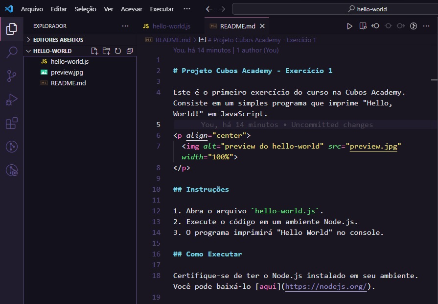

# Projeto Cubos Academy - Exercício 1

Este é o primeiro exercício do curso na Cubos Academy. Consiste em um simples programa que imprime "Hello, World!" em JavaScript.

<p align="center">
  
</p>

## Instruções

1. Abra o arquivo `hello-world.js`.
2. Execute o código em um ambiente Node.js.
3. O programa imprimirá "Hello World" no console.

## Como Executar

Certifique-se de ter o Node.js instalado em seu ambiente. Você pode baixá-lo [aqui](https://nodejs.org/).

Para executar o programa, siga os passos abaixo:

```bash
node hello-world.js